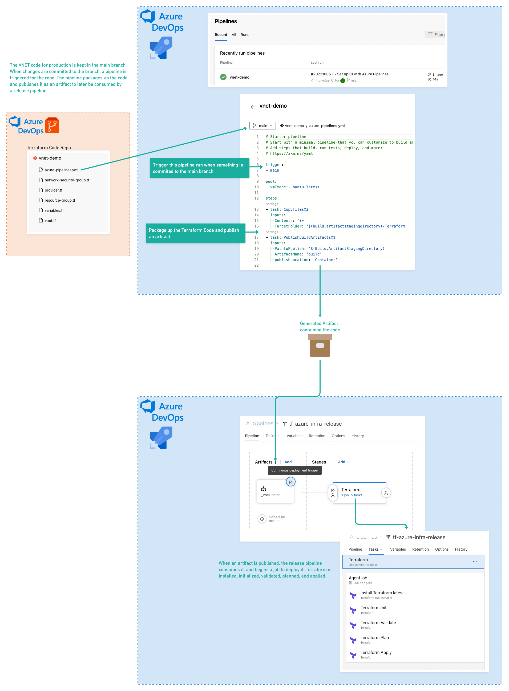

# AzureDevOps-terraform-pipelines
Examples of Azure DevOps pipelines interacting with Terraform OSS and the Terraform Cloud API

## Azure Pipelines and Release Pipelines
```Azure pipelines``` are configured to act upon a specific repository. In these examples, each Azure Devops repository is configured with an ```azure-pipelines.yml``` file. These pipelines build an artifact containing the terraform code whenever a change is introduced to the main branch. ```Azure Release Pipelines``` are configured to act upon specific artifacts. When a change is commited to the terraform repository, and a new artifact is created from the build pipeline, the release pipeline will pick up the new artifact and act upon it.

## Terraform Open Source Release Pipeline
In this example the release pipeline uses terraform open source to deploy the terraform code.




## Terraform Cloud API-Driven Workflow Release Pipeline
In this example the release pipelines uses the Terraform Cloud API to deploy the terraform code using a Terraform Cloud API-Driven Workspace. 

