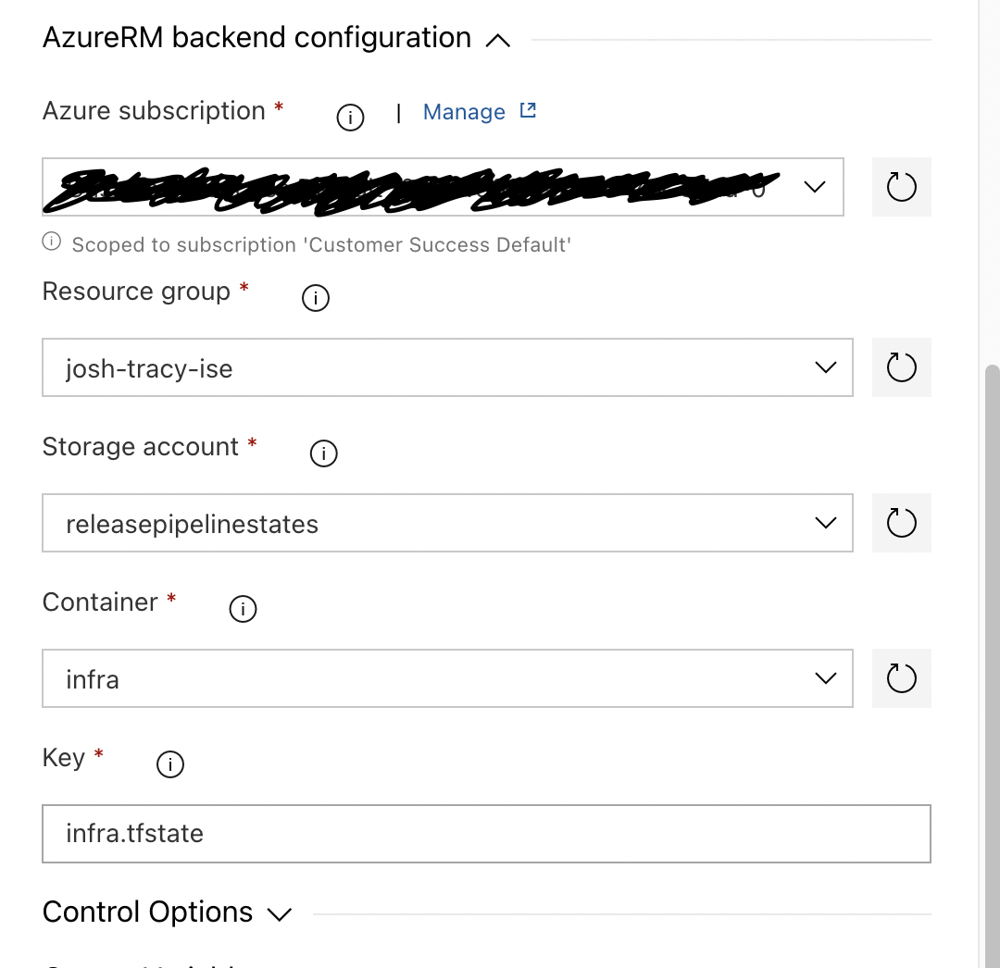
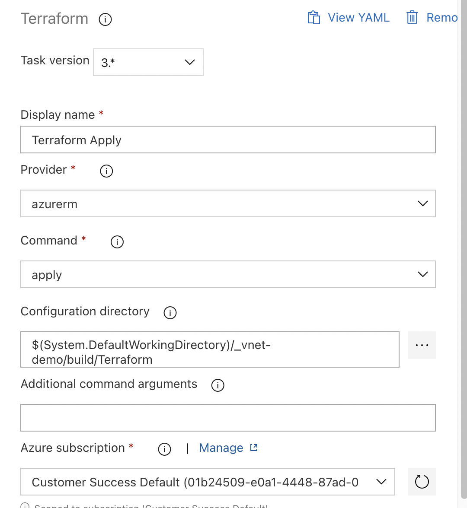

# TF OSS Azure DevOps Release Pipeline Tasks
Azure DevOps Release pipelines will take an artifact from a previous build pipeline and act upon it. In this case, you would have terraform code in a version control repository. When a change is commited to the repository, the build pipeline for that repository runs and generating an artifact containing the code. The release pipeline picks up the new artifact, and deploys it using Terraform Open Source.

## Requirements
- A build pipeline with a published artifact containing your terraform code.
- Terraform plugin installed from the marketplace.
- An existing Resource Group, Storage Account, and Container.
- An Azure DevOps Service Connection to the subscription containing the resource group.

## Tasks

### Install Terraform 
The ```Terraform tool installer``` task is installed with the Terraform plugin downloaded from the marketplace. This is the first task.
- Add the ```Terrafrom tool installer``` task.
- Choose a ```Dispaly name``` and ```Version``` of terraform to install.

### Terraform Init
The ```Terrafrom``` task is installed with the Terrafrom plugin downloaded from the marketplace. This is the second task.
- Add the ```Terrafrom``` task
- Choose the ```Provider```
- Choose the ```Command``` ```init```
- Add the ```Configuration directory``` like so ```$(System.DefaultWorkingDirectory)/_vnet-demo/build/Terraform``` the ```_vnet-demo``` is the name of the build pipeline that the artifact came from. The ```_``` is part of the alias. ```build``` is the ArtifactName from the pipeline that created the artifact. ```Terraform``` is the directory inside the artifact that contains the terrafrom code. So, ```$(System.DefaultWorkingDirectory)/<build_pipeline_alias>/<artifact_name>/<terraform_code_directroy>```
- Choose an ```Azure Subscription``` containing a Storage Account. This is to store the state files.
- Choose an ```Resource Group``` containing the Storage Account.
- Choose the ```Storage account```
- Choose the ```Container```
- Choose a ```Key```. The path to the Terraform remote state file inside the container. For example, if you want to store the state file, named terraform.tfstate, inside a folder, named tf, then give the input 'tf/terraform.tfstate'



### Terraform Validate
- Add the ```Terraform``` task.
- Choose the ```Provider```
- Choose the ```Command``` of ```validate```
- Choose the ```Configuration directory```. This should be the same as the configuration directory from the ```init``` task.


### Terraform Plan
- Add the ```Terraform``` task.
- Choose the ```Provider```
- Choose the ```Command``` of ```plan```
- Choose the ```Configuration directory```. This should be the same as the configuration directory from the ```init``` and ```validate``` tasks.
- Choose the ```Azure subscription``` you configured in the ```Terraform init``` task.


### Terraform Apply
- Add the ```Terraform``` task.
- Choose the ```Provider```
- Choose the ```Command``` of ```apply```
- Choose the ```Configuration directory```. This should be the same as the configuration directory from the ```init``` and ```validate``` tasks.
- Choose the ```Azure subscription``` you configured in the ```Terraform init``` task.
