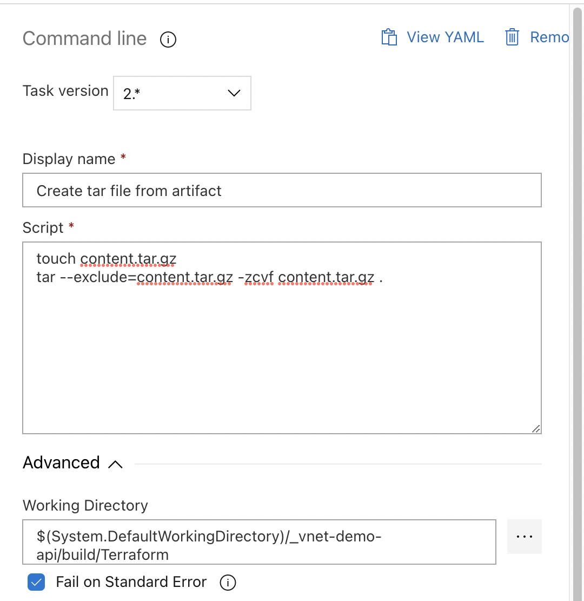
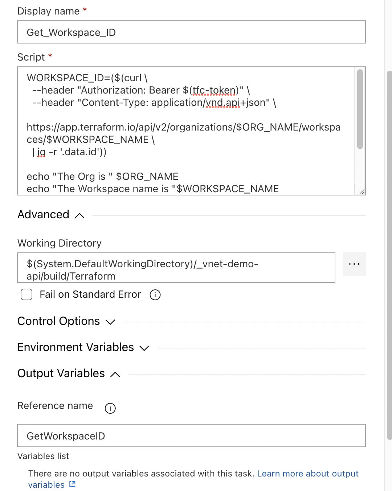

# Terraform Cloud API-Driven Workspace and Azure DevOps Release Pipeline Tasks
Azure DevOps Release pipelines will take an artifact from a previous build pipeline and act upon it. In this case, you would have terraform code in a version control repository. When a change is commited to the repository, the build pipeline for that repository runs and generates an artifact containing the code. The release pipeline picks up the new artifact, and deploys it using the Terraform Cloud API to create and upload a configuration version to a Terraform Cloud Workspace.

>Note: The following tasks were run on an Azure DevOps ```Linux``` agent. Results may vary on a Windows agent.

## Requirements
- A build pipeline with a published artifact containing your terraform code.
- An Azure Key Vault with a secret containing your Terraform Cloud Token.
- An Azure DevOps Service Connection to the subscription containing the Azure Key Vault.

## Tasks


### Create Pipeline Variables
- Within the variables tab of the release pipeline, add the following 2 variables:


### Install Packages
If your Azure DevOps agent does not have the `jq` package installed, we need to install it to parse the API data.
- Add the `Command line` task
- Add the `Script` ```sudo apt-get -y install jq```, assuming you are using a debian based system. I am using ubuntu 20.04.5 LTS.


### Create a TAR file from the Artifact
Package up the terraform code from `/Terraform` directory inside the artifact created by the build pipeline.
- Add the `Command line` task
- Add the following `Script` to creat the tar file.
```bash
touch content.tar.gz
tar --exclude=content.tar.gz -zcvf content.tar.gz .
```
- Add the `Working Directory` under the `Advanced` section like so ```$(System.DefaultWorkingDirectory)/_vnet-demo/build/Terraform``` the ```_vnet-demo``` is the name of the build pipeline that the artifact came from. The ```_``` is part of the alias. ```build``` is the ArtifactName from the pipeline that created the artifact. ```Terraform``` is the directory inside the artifact that contains the terrafrom code. So, ```$(System.DefaultWorkingDirectory)/<build_pipeline_alias>/<artifact_name>/<terraform_code_directroy>```


### Retrieve the Terraform Cloud Token from Azure Key Vault
Securly retrieve your Terraform Cloud API token from the Azure Key Vault. Hard coding this into the pipeline is not secure. 
- Add the `Azure Key Vault` task
- Choose the `Azure Subscription` containing the Key Vault
- Choose the `Key Vault`
- Ensure `Make secrets available to whole job` is selected.


### Get the Workspace ID
We need to get the ID of the Workspace in Terraform Cloud that we want to use.
- Add the `Command line` task
- Add the following `Script`
```bash
WORKSPACE_ID=($(curl \
  --header "Authorization: Bearer $(tfc-token)" \
  --header "Content-Type: application/vnd.api+json" \
  https://app.terraform.io/api/v2/organizations/$ORG_NAME/workspaces/$WORKSPACE_NAME \
  | jq -r '.data.id'))

echo "The Org is " $ORG_NAME
echo "The Workspace name is "$WORKSPACE_NAME
echo "The Workspace ID is "$WORKSPACE_ID

echo "##vso[task.setvariable variable=WORKSPACE_ID;isOutput=true]$WORKSPACE_ID"
```
- The final line is important, as it makes the variable created in this task available to tasks further down the pipeline within this same job.
- We pull the Terraform Cloud token out of the Azure Key Vault task my referencing the `$(tfc-token)` variable.
- Add the `Working Directory` under the `Advanced` section. This should be the same as the working directroy set in the `Create TAR File` task.
- Add `Reference name` under the `Output Variables` section. This will be referenced in other tasks as a way to retrieve the variables created by this task.


### Create a Configuration Version
We need to create the configuration version and get an upload URL.
- Add the `Command line` task
- Add the following `Script`
```bash
echo '{"data":{"type":"configuration-versions"}}' > ./create_config_version.json

UPLOAD_URL=($(curl \
  --header "Authorization: Bearer $(tfc-token)" \
  --header "Content-Type: application/vnd.api+json" \
  --request POST \
  --data @create_config_version.json \
  https://app.terraform.io/api/v2/workspaces/$(GetWorkspaceID.WORKSPACE_ID)/configuration-versions \
  | jq -r '.data.attributes."upload-url"'))

echo "The workspace ID is: "$(GetWorkspaceID.WORKSPACE_ID)
echo "The upload URL is: "$UPLOAD_URL

echo "##vso[task.setvariable variable=UPLOAD_URL;isOutput=true]$UPLOAD_URL"
```
- The final line is important, as it makes the variable created in this task available to tasks further down the pipeline within this same job.
- We reference `$(GetWorkspaceID.WORKSPACE_ID)` by refering to the `Output Variable` created in the previous task that creted the `WORKSPACE_ID` variable.
- We pull the Terraform Cloud token out of the Azure Key Vault task my referencing the `$(tfc-token)` variable.
- Add the `Working Directory` under the `Advanced` section. This should be the same as the working directroy set in the `Create TAR File` task.
- Add `Reference name` under the `Output Variables` section. This will be referenced in other tasks as a way to retrieve the variables created by this task.


### Upload the Config Version to the Workspace and Trigger a Run
Upload the terraform code to the Workspace and Trigger a run.
- Add the `Command line` task
- Add the following `Script`
```bash
curl \
  --header "Content-Type: application/octet-stream" \
  --request PUT \
  --data-binary @content.tar.gz \
  $(CreateConfigVersion.UPLOAD_URL)
```
- We reference `$(CreateConfigVersion.UPLOAD_URL)` by refering to the `Output Variable` created in the previous task that creted the `UPLOAD_URL` variable.
- Add the `Working Directory` under the `Advanced` section. This should be the same as the working directroy set in the `Create TAR File` task.


